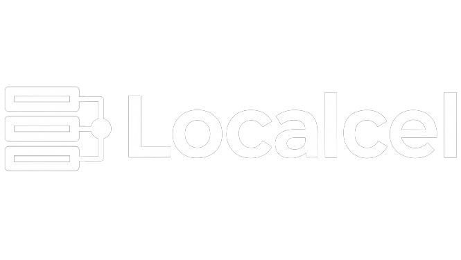
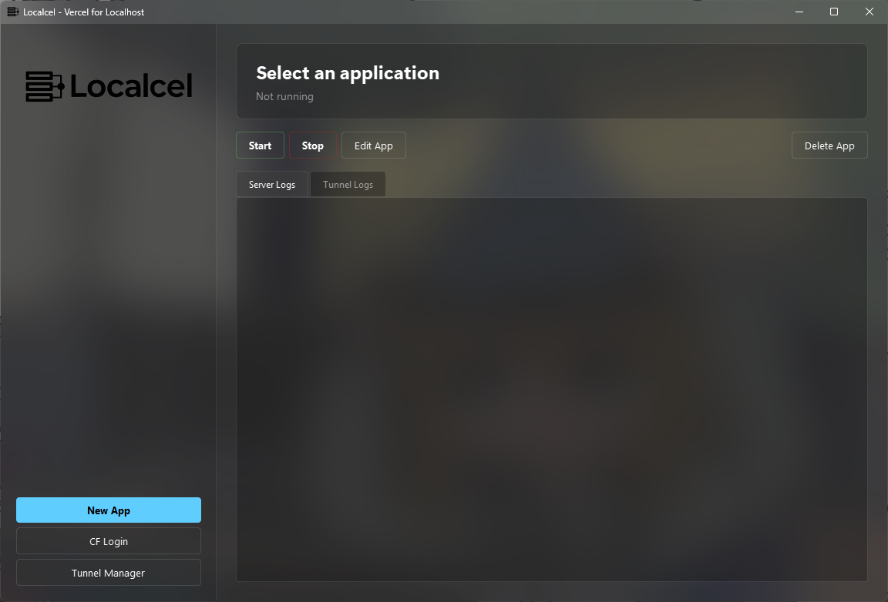

# Localcel ⚡

**A portable, Vercel-like environment for localhost.** Localcel provides a beautiful, native Windows 11 GUI to manage local Node.js servers and instantly expose them to the internet using Cloudflare Tunnels. 



## ✨ Features
* **Tiny Footprint (~5MB):** Uses a custom "Dropper" architecture. It doesn't bundle massive UI libraries; instead, it leverages the host machine's resources.
* **Auto-Setup:** Missing Python? Missing PyQt6? Localcel automatically detects missing dependencies, prompts you, and safely installs them in the background via `winget` and `pip`.
* **Deep Windows 11 Integration:** Features native Acrylic/TranslucentTB blur effects and system tray background execution.
* **1-Click Tunnels (Cloudflare Integration):** Instantly map local ports to live `https://` URLs. Behind the scenes, Localcel uses a robust `CloudflareHelper` module that:
  * **Auto-Installs Cloudflared:** If the `cloudflared` CLI is missing on Windows, Localcel automatically installs it via `winget`.
  * **Quick Tunnels:** Parses `cloudflared` background process logs to instantly expose ephemeral `trycloudflare.com` URLs for rapid testing.
  * **Persistent Named Tunnels:** Authenticates with your Cloudflare account to create and manage persistent Named Tunnels. It configures DNS routing and auto-generates proxy configurations (`tunnel.yml`) synced securely with your `~/.cloudflared` credentials.

---

## 🚀 How to Use (For Users)

1. Navigate to the **[Releases](../../releases)** page.
2. Download `Localcel.exe`.
3. Double-click to run. 
   * *Note: If you do not have Python 3 installed, Localcel will prompt you to automatically install it via Windows Package Manager (`winget`).*
4. Select a local directory to act as your "Workspace".
5. Create an app, assign a port, and click **Start**!

---

## 🛠️ How to Build (For Developers)

If you want to modify the source code and recompile the `.exe` yourself, follow these steps:

**Prerequisites:**
Ensure you have Python 3 installed. 

**1. Clone the repository:**
```bash
git clone https://github.com/edwinjosephshiju/Localcel.git
cd localcel
```

**2. Prepare your files:**
Make sure the following files are in the same folder:
- `localcel_optimized.py` (The main source code)
- `localcelBuilder.py` (The build script)
- `localcel_logo.ico` (Icon)
- `localcel_full.png` (Logo)

**3. Run the automated builder:**
```bash
python localcelBuilder.py
```
*The builder will automatically encode your images to Base64, inject them into the code, and invoke PyInstaller with the correct flags.*

**4. Locate your executable:**
Once complete, your portable application will be located in the `dist/` folder as `Localcel.exe`.


---


