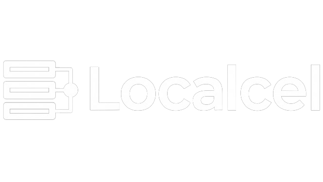
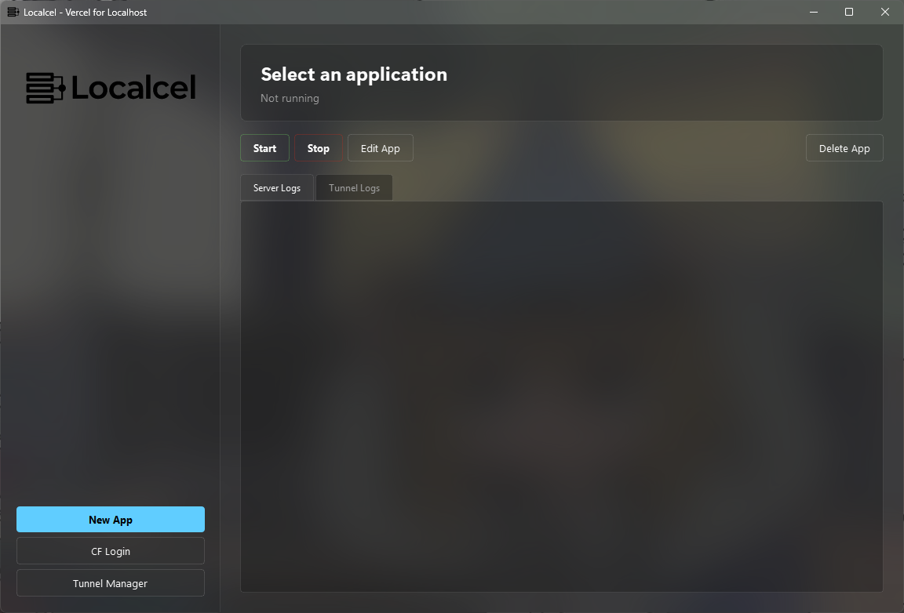

# Localcel ⚡ — Vercel-like Localhost Manager for Windows

> **Portable Windows 11 GUI to run & share local Node.js servers via Cloudflare Tunnels, with one-click GitHub Pages deployment. No config files needed.**

[](https://github.com/edwinjosephshiju/Localcel/releases)
[](https://www.python.org/)
[](LICENSE)
[](https://github.com/edwinjosephshiju/Localcel/releases)



---

## What is Localcel?

**Localcel** is a portable, zero-config **localhost management tool** for Windows 11. It gives you a beautiful native GUI — inspired by [Vercel](https://vercel.com) — to **start, stop, and share local Node.js servers** and **static sites** without ever touching a terminal.

With a single click you can:
- Tunnel your `localhost` to a **public HTTPS URL** via Cloudflare Tunnels
- Deploy a static folder directly to **GitHub Pages**
- Manage multiple dev servers with **automatic port-conflict detection**

> **Who is this for?** Frontend developers, full-stack developers, and indie hackers on Windows who need to demo projects, share previews with clients, or host personal sites — all without cloud infrastructure complexity.

---

## ✨ Key Features

| Feature | Description |
|---|---|
| 🌐 **Cloudflare Tunnel Integration** | Instantly expose any `localhost` port to a shareable public HTTPS URL using [Cloudflare Tunnels](https://developers.cloudflare.com/cloudflare-one/connections/connect-networks/). Supports ephemeral *TryCloudflare* URLs and persistent **Named Tunnels** with custom domains. |
| 🚀 **One-Click GitHub Pages Deploy** | Deploy any local static folder to GitHub Pages. Localcel handles repository creation, `git init`, commits, and DNS configuration via the GitHub CLI — no manual Git commands needed. |
| 🖥️ **Native Windows 11 UI** | Built with **PyQt6**, featuring native **Mica/Acrylic** blur effects, a System Tray icon for background mode, and a clean card-based dashboard. |
| 📦 **Tiny ~9 MB Executable** | Uses a "Dropper" architecture: the `.exe` is a lightweight launcher that installs PyQt6 on the host machine on first run, keeping the binary tiny without sacrificing functionality. |
| 🔧 **Auto Dependency Management** | No Python? No problem. Localcel detects missing runtimes (Python 3, PyQt6, psutil) and installs them automatically via `winget` and `pip` on first launch. |
| 🔌 **Intelligent Port Checker** | Before starting a server, Localcel scans for port conflicts using `psutil`. If a port is taken, it prompts you to select a free one — no more `EADDRINUSE` errors. |
| 📁 **Workspace Management** | Organise all your local apps under a single workspace directory. Each app gets its own config, logs, and entry-point scaffolding. |

---

## 🖼️ Screenshots



---

## 🚀 Quick Start — How to Use Localcel (No Build Required)

> **The fastest way to get started.** Just download and run the pre-built `.exe`.

**Step 1 — Download the executable**

Go to the **[Releases page](https://github.com/edwinjosephshiju/Localcel/releases)** and download the latest `Localcel.exe`.

**Step 2 — Run it**

Double-click `Localcel.exe`. On first run it will:
1. Detect if Python 3 is installed (and install it via `winget` if not).
2. Install required Python libraries (`PyQt6`, `psutil`).
3. Ask you to select a **Workspace directory** — a folder where all your apps will live.

**Step 3 — Create and start an app**

1. Click **"New App"** in the dashboard.
2. Enter a name and assign a port (e.g., `3000`).
3. Choose your app type: **Node.js server** or **Static site**.
4. Click **Start** ▶️ — your local server is now running.

**Step 4 — Share it with the world**

Click **"Expose via Cloudflare Tunnel"** to generate a public HTTPS URL instantly. Share that URL with anyone — no firewall rules, no port forwarding required.

---

## 📖 Primary Use Cases

### 1. Share `localhost` With a Client or Teammate
Running a local dev server on port `3000`? Click one button to get a public URL like `https://abc123.trycloudflare.com` and share it — great for demos, feedback sessions, and design reviews.

### 2. Deploy a Static Site to GitHub Pages
Have a portfolio, landing page, or documentation folder? Localcel turns it into a live GitHub Pages site in seconds — no terminal, no YAML pipelines.

### 3. Manage Multiple Local Node.js Servers
Working on several projects simultaneously? Localcel's dashboard shows all running servers, their ports, and live status in one place, with instant start/stop controls.

### 4. Persistent Background Hosting via System Tray
Need your local server to keep running while you work? Minimise Localcel to the System Tray. It keeps running silently in the background without a visible window.

### 5. Run Webhooks and Local API Testing
Expose a local REST API or webhook receiver to the internet for testing with services like Stripe, GitHub, or Twilio — no `ngrok` account required.

---

## 🛠️ How to Build From Source (For Developers)

Want to modify Localcel or compile your own `.exe`? Follow these steps.

### Prerequisites

- **Python 3.8+** — [python.org](https://www.python.org/downloads/)
- **PyInstaller** (auto-installed by the build script if missing)

### 1. Clone the repository

```bash
git clone https://github.com/edwinjosephshiju/Localcel.git
cd Localcel
```

### 2. Verify required files

Ensure the following files exist in the project root:

```
localcel_optimized.py   # Main application source
localcelBuilder.py      # Automated build script
localcel_logo.ico       # App icon
localcel_full.png       # Logo image
```

### 3. Run the build script

```bash
python localcelBuilder.py
```

The builder will:
1. Encode `localcel_logo.ico` and `localcel_full.png` as **Base64 strings**.
2. Inject them into a temporary staging copy of the source file.
3. Invoke **PyInstaller** with `--onefile --noconsole` flags.
4. Clean up all temporary build artifacts.

### 4. Collect your executable

```
dist/
└── Localcel.exe   ✅ Your portable, single-file application
```

---

## 🏗️ Architecture Overview

Localcel uses a **"Dropper" architecture** to stay tiny:

```
Localcel.exe (~9 MB)
│
├── Outer Shell (Python + PyInstaller, no UI libs bundled)
│   └── On launch: checks for PyQt6 on host → installs if missing → re-launches
│
└── Inner Payload (full PyQt6 GUI, stored as a string, executed at runtime)
    ├── CloudflareHelper   — manages cloudflared tunnel lifecycle
    ├── AppManager         — CRUD for workspace apps and configs (JSON)
    ├── PortChecker        — psutil-based port conflict detection
    └── GitHubPagesDeployer — git + gh CLI integration for Pages deployment
```

This design keeps the binary small while giving users a full-featured desktop app on their first run.

---

## 🧰 Tech Stack

| Component | Technology |
|---|---|
| GUI Framework | [PyQt6](https://pypi.org/project/PyQt6/) |
| Windows Effects | Native Mica / Acrylic via Win32 API |
| Tunneling | [Cloudflare Tunnels (`cloudflared`)](https://developers.cloudflare.com/cloudflare-one/connections/connect-networks/) |
| Static Deployment | [GitHub Pages](https://pages.github.com/) + [GitHub CLI (`gh`)](https://cli.github.com/) |
| Packaging | [PyInstaller](https://pyinstaller.org/) |
| Process Management | [psutil](https://pypi.org/project/psutil/) |
| Dependency Bootstrap | [winget](https://learn.microsoft.com/en-us/windows/package-manager/winget/) + pip |
| Language | Python 3.8+ |

---

## ❓ FAQ

**Q: Does Localcel work on macOS or Linux?**  
A: Currently Localcel is **Windows-only**. The native Mica/Acrylic UI effects and `winget` integration are Windows 11 specific. Cross-platform support may be added in a future release.

**Q: Do I need a Cloudflare account to use tunnels?**  
A: No! For quick sharing, Localcel uses **TryCloudflare** ephemeral tunnels — no account or login needed. For persistent tunnels with custom domains, a free Cloudflare account is required.

**Q: Is my local code uploaded anywhere?**  
A: No. Cloudflare Tunnels only proxy HTTP traffic — your source code never leaves your machine. GitHub Pages deployment pushes only the files you explicitly select.

**Q: Can I use Localcel with frameworks like React, Vue, or Next.js?**  
A: Yes. Any app with a local HTTP server (started by `npm run dev`, `vite`, etc.) can be exposed through Localcel. Point it to the same port your dev server uses.

**Q: How is this different from ngrok?**  
A: Localcel is a full **GUI-based localhost manager**, not just a tunnel tool. It manages server startup/shutdown, port conflicts, workspace organisation, and GitHub Pages deployment — all in one native Windows app. Tunneling is just one of its features.

---

## 🤝 Contributing

Contributions, issues, and feature requests are welcome!

1. Fork the repository.
2. Create a feature branch: `git checkout -b feature/your-feature-name`
3. Commit your changes: `git commit -m 'feat: add your feature'`
4. Push and open a Pull Request.

Please open an **[Issue](https://github.com/edwinjosephshiju/Localcel/issues)** first to discuss significant changes.

---

## 📄 License

Distributed under the **MIT License**. See [`LICENSE`](LICENSE) for full details.

---

## ⭐ Support

If Localcel saves you time, consider giving it a ⭐ on GitHub — it helps others discover the project!

[](https://github.com/edwinjosephshiju/Localcel/stargazers)
